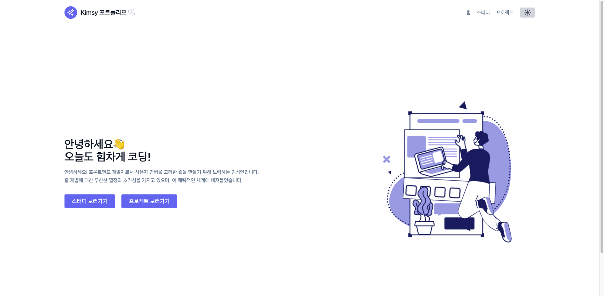

# Web Portfolio - NEXT.JS

<p align="center">
  <br>
    
  <br>
</p>

NEXT.JS로 만든 웹 포트폴리오

<br>

## 기술 스택

|  React   |  NEXT.JS  | JavaScript | TailwindCSS |  Notion   |
| :------: | :-------: | :--------: | :---------: | :-------: |
| ![react] | ![nextjs] |   ![js]    |    ![tw]    | ![notion] |

<br>

## 진행 목적

- `React`, `NEXT.JS` 사용
- CSS 프레임워크 `TailwindCSS` 사용
- `Notion API`로 데이터베이스 관리
- 사용자 화면을 고려한 반응형 UI 디자인

<br>

## 결과물

Vercel - [https://nextjs-portfolio-self-sy.vercel.app/](https://nextjs-portfolio-self-sy.vercel.app/)  
[자세히 보기](https://kim228sy.github.io/nextjs-portfolio/)

<br>

## 구현 요구 사항

- [✅] 사용자 화면을 고려한 반응형 웹 사이트
- [✅] 심플하고 가독성이 높은 UI
- [✅] 다크모드 바닐라JS 구현
- [✅] 스터디 / 프로젝트 페이지 분리
- [✅] Notion API 연동
- [✅] Vercel로 배포

<br>

## 사용한 프레임워크 / 라이브러리 설명

- React: 컴포넌트 기반의 화면구성, Virtual DOM으로 인한 속도 향상, SPA(싱글 페이지 애플리케이션)
- NEXT.JS: React에서 SSR(서버 사이드 렌더링)을 지원
- TailwindCSS: 클래스 이름을 지을 필요없으며 유지관리에 용이

<br>

## 실행 방법

```
npm install
npm start
```

<!-- Stack Icon Refernces -->

[react]: /public//stack/react.svg
[nextjs]: /public/stack/nextjs.svg
[js]: /public/stack/javascript.svg
[tw]: /public/stack/tailwindcss.svg
[notion]: /public/stack/notion.svg
